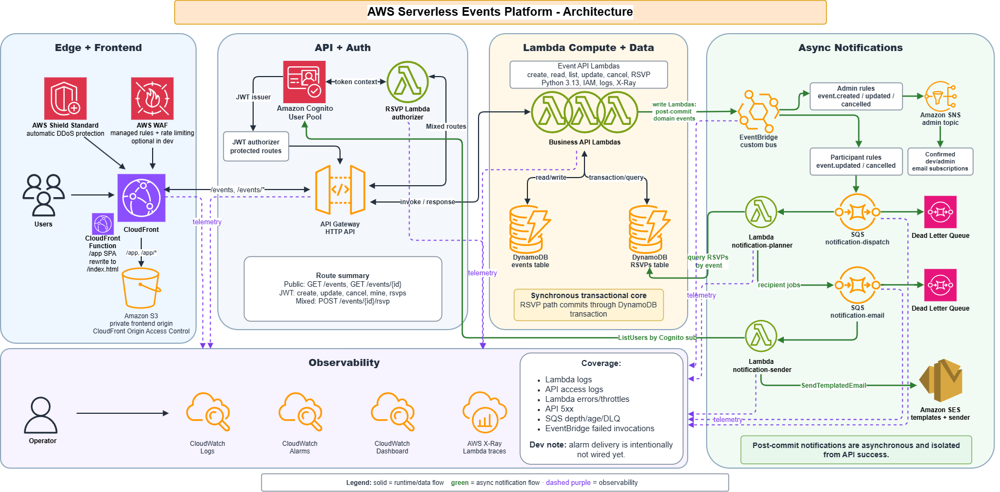
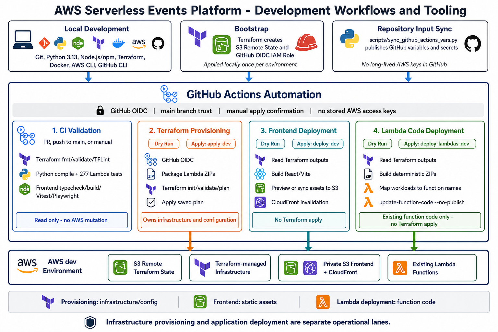
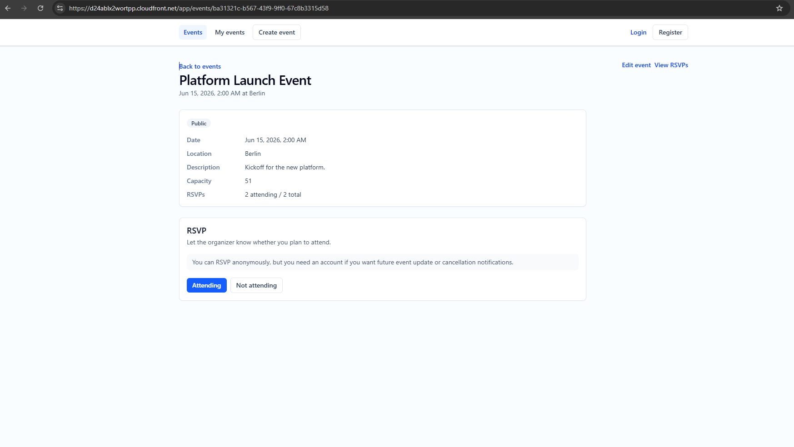
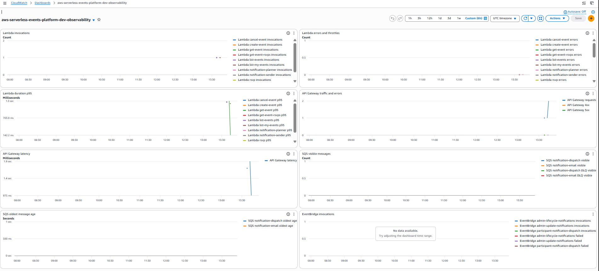

# AWS Serverless Events Platform

[](https://github.com/Mazdaratti/aws-serverless-events-platform/actions/workflows/ci.yml)
[](./LICENSE)

[](https://aws.amazon.com/serverless/)
[](https://www.terraform.io/)
[](https://www.python.org/)
[](https://github.com/features/actions)
[](https://react.dev/)
[](https://www.docker.com/)

A production-style AWS serverless web application for managing events and RSVP
workflows.

Built as a **cloud engineering portfolio project**, the platform demonstrates
how a complete serverless application can be designed, provisioned, secured,
observed, tested, and deployed on AWS.

The infrastructure is composed with reusable **Terraform** modules and uses
**Amazon CloudFront**, **AWS WAF**, **Amazon S3**, **Amazon API Gateway**,
**AWS Lambda**, **Amazon DynamoDB**, **Amazon Cognito**, **Amazon EventBridge**,
**Amazon SQS**, **Amazon SNS**, **Amazon SES**, **Amazon CloudWatch**, and
**AWS X-Ray**.

The **React and TypeScript** frontend is delivered through a private S3 origin,
while transactional API operations and asynchronous notification workflows
remain clearly separated.

**Engineering and delivery highlights:**

- **Infrastructure as Code:** Terraform modules, remote S3 state, and native
  state locking
- **Security:** least-privilege IAM, Cognito-managed identity, edge protection,
  and GitHub OIDC without long-lived AWS credentials
- **Backend and automation:** Python 3.13 Lambda workloads and Python helper
  scripts for deterministic packaging, deployment previews, and GitHub input
  synchronization
- **Frontend:** React, Vite, TypeScript, and Tailwind CSS
- **Automated validation:** pytest, Vitest, React Testing Library, Playwright,
  Terraform validation, and TFLint
- **CI/CD:** separate GitHub Actions dry-run and apply workflows for Terraform
  provisioning, frontend deployment, and Lambda code deployment
- **Observability:** CloudWatch logs, alarms, dashboards, and active Lambda
  tracing with X-Ray

---

## Portfolio Showcase

Current AWS serverless architecture and application workflows:



Development workflows, tooling, and deployment boundaries:



Product workflow through CloudFront:



CloudWatch operational dashboard:



Additional evidence:

- [Event listing through CloudFront](docs/assets/showcase/01-product-event-list.png)
- [Owner event management view](docs/assets/showcase/03-product-owner-rsvp-list.png)
- [GitHub Actions workflow inventory](docs/assets/showcase/04-github-actions-workflows.png)
- [Provisioning apply workflow success](docs/assets/showcase/06-provisioning-apply-success.png)
- [Lambda deployment apply workflow success](docs/assets/showcase/05-lambda-deploy-apply-success.png)
- [X-Ray trace map](docs/assets/showcase/08-xray-trace-map.png)
- [CloudWatch alarms](docs/assets/showcase/09-cloudwatch-alarms.png)

---

## Engineering Principles

- **Managed serverless architecture:** use AWS managed services to reduce
  operational overhead while preserving production-shaped service boundaries.
- **Transactional core with asynchronous extensions:** keep business writes
  synchronous and use event-driven processing for isolated post-commit work.
- **Infrastructure as Code:** Terraform owns infrastructure and configuration;
  frontend assets and Lambda code use separate deployment lanes.
- **Security by design:** apply least-privilege IAM, Cognito-managed identity,
  private S3 origins, optional WAF protection, and SQS failure isolation.
- **Operational visibility:** provide CloudWatch logs, metrics, alarms, and
  dashboards together with Lambda X-Ray tracing.
- **Cost-aware development:** avoid EC2, NAT Gateways, and relational databases;
  optional steady-cost features such as WAF remain disabled by default in
  `dev`.
- **Incremental delivery:** keep changes small and reviewable, validate them in
  AWS, and support future environments through reusable Terraform modules.

---

## Delivered Capabilities

The deployed and validated `dev` platform includes:

- **Serverless infrastructure:** modular Terraform composition for DynamoDB,
  Lambda, API Gateway, Cognito, EventBridge, SQS, SNS, SES, CloudFront, S3,
  optional WAF protection, CloudWatch, and X-Ray.
- **Application workloads:** dedicated Lambda functions for event creation,
  listing, retrieval, updates, cancellation, RSVP processing, owner views, and
  RSVP administration, with transactional DynamoDB write paths.
- **Identity and edge delivery:** Cognito authentication, JWT and mixed-mode
  Lambda authorization, a private S3 frontend origin, CloudFront SPA routing,
  and same-origin API delivery.
- **Asynchronous notifications:** post-commit EventBridge domain events, SNS
  admin notifications, SQS-buffered participant notification planning, and SES
  templated email delivery with dedicated planner and sender workers.
- **Frontend application:** a responsive React, Vite, and TypeScript SPA with
  public event discovery, mixed-mode RSVP, and authenticated event-management
  workflows.
- **Observability and validation:** CloudWatch alarms and dashboards, Lambda
  X-Ray tracing, Python Lambda tests, Terraform validation, and frontend
  component and browser tests.
- **Secure delivery automation:** S3 remote Terraform state, native state
  locking, GitHub OIDC authentication, and separate manual workflows for
  provisioning, frontend deployment, and Lambda code deployment.

Detailed delivery history and planned work are recorded in the
[implementation roadmap](docs/implementation-roadmap.md).

---

## Current Architecture

The deployed `dev` environment uses these AWS serverless services:

- Amazon CloudFront
- AWS WAF
- Amazon S3
- Amazon API Gateway
- AWS Lambda
- Amazon DynamoDB
- Amazon Cognito
- Amazon SQS
- Amazon EventBridge
- Amazon SNS
- Amazon SES
- Amazon CloudWatch
- AWS X-Ray

AWS Shield Standard provides automatic edge protection. AWS WAF is available
as an optional environment-controlled edge protection layer and is disabled by
default in `dev`.

---

## System Workflows

### Frontend and API Delivery

CloudFront is the public entry point for the platform. It serves the React SPA
from a private S3 origin under `/app`, forwards same-origin `/events` requests
to API Gateway, and applies SPA deep-link rewrites without changing API paths.
AWS WAF can optionally filter traffic at the CloudFront edge.

API Gateway routes requests to dedicated Lambda workloads. Cognito JWT
authorization protects ordinary authenticated routes, while a Lambda
authorizer supports anonymous and authenticated callers on the mixed-mode RSVP
route.

### Synchronous Business Operations

Event and RSVP operations use the synchronous path:

```text
Client -> CloudFront -> API Gateway -> Lambda -> DynamoDB
```

Transactional DynamoDB writes preserve immediate business outcomes for event
management and RSVP processing, including authorization, event state, and
capacity rules.

### Asynchronous Notifications

After successful event creation, update, or cancellation, write workloads
publish compact domain events to EventBridge. EventBridge routes:

- admin notifications to SNS
- participant update and cancellation work through:

```text
EventBridge -> dispatch SQS -> planner Lambda
            -> email SQS -> sender Lambda -> SES
```

The planner creates recipient-level jobs, while the sender resolves current
Cognito email addresses and delivers SES-templated messages. Notification
failures remain isolated from the original API result.

### Observability

CloudWatch provides logs, alarms, metrics, and a compact operational dashboard
for Lambda, API Gateway, SQS, and EventBridge. AWS X-Ray active tracing is
enabled for deployed Lambda workloads.

Detailed service relationships are documented in
[architecture.md](docs/architecture.md). Product, authorization, and runtime
contracts are documented in
[platform-behavior.md](docs/platform-behavior.md).

---

## Key Architecture Decisions

- **Fully managed serverless:** managed AWS services provide scaling and remove
  server and cluster administration.
- **Synchronous core, asynchronous extensions:** business writes commit
  synchronously, while EventBridge, SNS, SQS, and SES handle isolated
  post-commit notification work.
- **Managed identity with route-specific authorization:** Cognito owns identity
  and token issuance; API Gateway uses JWT authorization for ordinary protected
  routes and a Lambda authorizer for mixed-mode RSVP access.
- **No VPC dependency:** the current managed-service architecture avoids VPC,
  NAT Gateway, and private-network administration.
- **Remote Terraform state:** the bootstrap root creates the S3 backend used by
  `dev`, including native lockfile support. Provisioning and application
  deployment remain separate operational lanes.
- **Modular, composition-oriented Terraform:** reusable resource logic belongs
  in focused modules, while `infrastructure/envs/dev` owns environment
  composition and concrete cross-resource wiring.
- **Incremental hardening:** infrastructure slices are validated in AWS before
  reusable modules are tightened, documented, example-backed, and added to CI.

Detailed rationale and service boundaries are documented in
[architecture.md](docs/architecture.md). Environment composition and remote
state are documented in
[infrastructure/envs/dev/README.md](infrastructure/envs/dev/README.md).

---

## Repository Structure

```text
aws-serverless-events-platform/
|-- .github/workflows/       CI, OIDC smoke, provisioning, and deployment workflows
|-- docs/                    Architecture, behavior, setup, roadmap, and evidence
|-- frontend/                React, Vite, and TypeScript SPA
|-- infrastructure/
|   |-- bootstrap/dev/       Remote state and GitHub OIDC bootstrap
|   |-- envs/dev/            Composed Terraform development environment
|   `-- modules/             Reusable Terraform modules and examples
|-- lambdas/                 Python workloads, shared helpers, and packaging notes
|-- scripts/                 Packaging, deployment, and repository sync helpers
|-- tests/                   Lambda handler and shared Python tests
|-- LICENSE
`-- README.md
```

Generated Lambda ZIP artifacts are written under the ignored
`artifacts/lambda/` directory. Detailed ownership and usage are documented in
the README files within each project area.

---

## Implementation Roadmap

The detailed implementation history and planned development direction are
maintained in:

- [Infrastructure Implementation Roadmap](docs/implementation-roadmap.md)

The platform foundations, application workflows, observability baseline,
remote Terraform operations, and separate provisioning and deployment
automation lanes are complete.

The next planned direction focuses on account lifecycle and Cognito
account-management behavior.

---

## Documentation

Project documentation is split by purpose:

- [implementation-roadmap.md](docs/implementation-roadmap.md): chronological
  implementation history, completed milestones, and planned development work.
- [architecture.md](docs/architecture.md): platform architecture, service
  boundaries, and implementation direction.
- [platform-behavior.md](docs/platform-behavior.md): product/API behavior,
  authorization semantics, and runtime platform contracts.
- [project-setup.md](docs/project-setup.md): setup and operations runbook for
  bootstrap, provisioning, deployment workflows, and local tooling.
- [frontend/README.md](frontend/README.md): frontend validation, runtime
  rules, deployment helper behavior, and CloudFront validation.
- [lambdas/README.md](lambdas/README.md): Lambda packaging, artifact layout, and
  workload-specific packaging notes.
- [infrastructure/envs/dev/README.md](infrastructure/envs/dev/README.md): composed
  `dev` Terraform environment.
- Terraform modules each include a module-specific `README.md` in the module
  root directory.

---

## Developer Tooling

| Area | Technologies |
|---|---|
| Infrastructure | Terraform, AWS CLI, `tflint`, `terraform-docs` |
| Backend | Python 3.13, AWS Lambda |
| Frontend | React, Vite, TypeScript, Tailwind CSS |
| Validation | pytest, Vitest, React Testing Library, Playwright |
| Automation | GitHub Actions, GitHub OIDC, GitHub CLI, Docker |

Setup and operational commands are documented in
[project-setup.md](docs/project-setup.md). Frontend-specific tooling is
documented in [frontend/README.md](frontend/README.md).

---

## Longer-Term Opportunities

- Custom domain, Route 53, and ACM-managed TLS
- Production alert delivery and escalation routing
- Multi-environment promotion and release strategy
- Production SES deliverability with domain identity, DKIM, SPF, DMARC, and
  custom MAIL FROM
- Additional security controls guided by a production threat model
