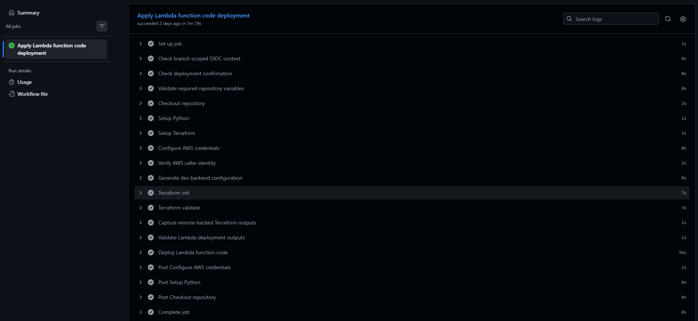

# AWS Serverless Events Platform

[](https://github.com/Mazdaratti/aws-serverless-events-platform/actions/workflows/ci.yml)
[](./LICENSE)

A production-style, fully AWS-native serverless web application for managing events and RSVP workflows.

The system demonstrates modern cloud architecture patterns including transactional serverless writes, event-driven extensions, managed authentication, edge security, and Infrastructure as Code using Terraform.

This project is designed as a **cloud engineering portfolio showcase** and follows real-world engineering practices such as least-privilege IAM, cost-aware design, incremental delivery, and modular infrastructure composition.

---

## Portfolio Snapshot

This project showcases:

- end-to-end AWS serverless application delivery with CloudFront, API Gateway,
  Lambda, DynamoDB, Cognito, EventBridge, SQS, SNS, SES, CloudWatch, and X-Ray
- modular Terraform infrastructure with reusable modules, examples, generated
  documentation, and CI validation
- GitHub Actions deployment automation using AWS OIDC instead of long-lived AWS
  credentials
- separated operational lanes for Terraform provisioning, frontend asset
  deployment, and Lambda code deployment
- transactional DynamoDB write paths with asynchronous notification fanout
- React/Vite frontend delivery through a private S3 origin and CloudFront

Showcase visuals:

Current AWS serverless architecture and application workflows:


Development workflows, tooling, and deployment boundaries:


Product workflow through CloudFront:


CloudWatch operational dashboard:


Code-only Lambda deployment through GitHub Actions:



Additional evidence:

- [Event listing through CloudFront](docs/assets/showcase/01-product-event-list.png)
- [Owner event management view](docs/assets/showcase/03-product-owner-rsvp-list.png)
- [GitHub Actions workflow inventory](docs/assets/showcase/04-github-actions-workflows.png)
- [Provisioning apply workflow success](docs/assets/showcase/06-provisioning-apply-success.png)
- [X-Ray trace map](docs/assets/showcase/08-xray-trace-map.png)
- [CloudWatch alarms](docs/assets/showcase/09-cloudwatch-alarms.png)

---

## Project Goals

- Build a production-shaped serverless platform using managed AWS services
- Demonstrate **transactional API workflows with asynchronous extensions**
- Apply security best practices (edge protection, managed identity, least privilege)
- Implement observability and operational readiness patterns
- Use Terraform as the single source of infrastructure truth
- Follow clean Git workflow and small, reviewable infrastructure changes
- Stay within AWS Free Tier and promotional credits

---

## Delivered Capabilities

The deployed and validated `dev` platform includes:

- **Serverless infrastructure:** modular Terraform composition for DynamoDB,
  Lambda, API Gateway, Cognito, EventBridge, SQS, SNS, SES, CloudFront, S3,
  optional WAF protection, CloudWatch, and X-Ray.
- **Application workloads:** dedicated Lambda functions for event creation,
  listing, retrieval, updates, cancellation, RSVP processing, owner views, and
  RSVP administration, with transactional DynamoDB write paths.
- **Identity and edge delivery:** Cognito authentication, JWT and mixed-mode
  Lambda authorization, a private S3 frontend origin, CloudFront SPA routing,
  and same-origin API delivery.
- **Asynchronous notifications:** post-commit EventBridge domain events, SNS
  admin notifications, SQS-buffered participant notification planning, and SES
  templated email delivery with dedicated planner and sender workers.
- **Frontend application:** a responsive React, Vite, and TypeScript SPA with
  public event discovery, mixed-mode RSVP, and authenticated event-management
  workflows.
- **Observability and validation:** CloudWatch alarms and dashboards, Lambda
  X-Ray tracing, Python Lambda tests, Terraform validation, and frontend
  component and browser tests.
- **Secure delivery automation:** S3 remote Terraform state, native state
  locking, GitHub OIDC authentication, and separate manual workflows for
  provisioning, frontend deployment, and Lambda code deployment.

Detailed delivery history and planned work are recorded in the
[implementation roadmap](docs/implementation-roadmap.md).

---

## Current Architecture

The deployed `dev` environment uses these AWS serverless services:

- Amazon CloudFront
- AWS WAF
- Amazon S3
- Amazon API Gateway
- AWS Lambda
- Amazon DynamoDB
- Amazon Cognito
- Amazon SQS
- Amazon EventBridge
- Amazon SNS
- Amazon SES
- Amazon CloudWatch
- AWS X-Ray

AWS Shield Standard provides automatic edge protection. AWS WAF is available
as an optional environment-controlled edge protection layer and is disabled by
default in `dev`.

---

## System Workflows

### Frontend Delivery

1. Users access the application through **Amazon CloudFront**.
2. CloudFront securely serves static frontend assets from a private **Amazon
   S3** bucket.
3. Frontend browser routes are served under `/app`.
4. When enabled, **AWS WAF** filters traffic at the edge before requests reach
   the frontend or backend origins.

### Frontend Routing Model

The frontend is delivered as a SPA under:

- `/app`

API routes remain under:

- `/events`

CloudFront handles SPA deep-link routing for `/app/*` without affecting API behavior.

### API Request Flow

5. The frontend sends same-origin API requests through **Amazon CloudFront** to **Amazon API Gateway**.
6. Route protection is enforced at API Gateway using a hybrid authorizer model:
   - native JWT authorizer for ordinary protected routes
   - a dedicated Lambda authorizer for the mixed-mode RSVP route

### Event Management

7. API Gateway invokes dedicated **Lambda functions** for event and RSVP
   operations.
8. Event and RSVP records are stored in **Amazon DynamoDB**.

### RSVP Processing

9. RSVP submissions are handled as a **synchronous business operation**.
10. The primary RSVP write path is:

`Client -> CloudFront -> API Gateway -> Lambda -> DynamoDB transaction`

11. This design preserves the current API contract so the caller immediately knows whether:
- the RSVP was created
- the RSVP was updated
- the event is already at capacity
- access is forbidden
- the event does not exist

### Event-Driven Extensions

12. After a successful durable event-management write, one compact domain event
is published to **Amazon EventBridge**.
13. EventBridge routes admin notifications directly to an **Amazon SNS** admin
topic. In the current direct-SNS baseline, EventBridge input transformers
provide lightweight admin email formatting with the full CloudFront event URL.
14. EventBridge routes participant-notification planning work to **Amazon SQS**.
15. The participant notification path is:

`EventBridge -> notification-dispatch SQS -> notification-planner Lambda -> notification-email SQS -> notification-sender Lambda -> SES`

16. The deployed `notification-planner` creates one recipient-level email job
per authenticated RSVP user for event update and cancellation notifications.
17. The SES baseline provides the sender identity and reusable participant email
templates for update and cancellation notifications.
18. The deployed `notification-sender` consumes recipient-level jobs from
`notification-email`, resolves the current recipient email through Cognito at
send time, selects the SES template, provides safe template data, and sends
participant email through **Amazon SES**.

The planner and sender execution roles are provisioned separately with
least-privilege IAM.

Participant emails are user-facing product emails, not admin/debug messages.
The planner produces safe recipient-level jobs. SES owns reusable template
definitions, and the sender owns template selection, safe template data, and
delivery.

In `dev`, SES uses a verified project sender inbox and sandbox-verified
recipient addresses. Production-shaped deliverability improvements such as a
custom domain identity, DKIM, SPF, DMARC, and MAIL FROM configuration remain
future email-deliverability work.

The v1 event-management domain events are:

- `event.created`
- `event.updated`
- `event.cancelled`

EventBridge owns fanout, and notification publication or delivery failures must
not change the original synchronous API result.

### Observability

19. Logs and metrics are collected in **Amazon CloudWatch**.
20. **AWS X-Ray** active tracing is enabled for deployed Lambda workloads in
`dev` to analyze request performance and dependencies.
21. CloudWatch metric alarms are deployed for Lambda errors/throttles, API
Gateway 5xx responses, SQS queue depth/age/DLQ depth, and EventBridge failed
invocations.
22. A compact CloudWatch dashboard is deployed for Lambda, API Gateway, SQS,
and EventBridge runtime visibility.

API Gateway active tracing is not enabled because the platform uses API Gateway
HTTP API, while API Gateway active tracing applies to REST APIs.

CloudWatch alarm actions are intentionally empty in `dev`; alert routing is
kept separate from the first metric coverage baseline.

This design preserves immediate correctness for core business writes while
using asynchronous processing for post-commit notification work.

---

## Key Architecture Decisions

**Fully Serverless Design**

Avoids infrastructure management and enables automatic scaling.

**Synchronous Core, Async Extensions**

Core business writes are intentionally kept synchronous so the system can
preserve immediate business-result semantics required by the current API
contract.

Asynchronous processing is reserved for durable post-commit work. EventBridge
owns notification fanout, SNS handles admin broadcasts, and SQS buffers
participant-notification work outside the primary API write path.

**Managed Authentication**

Amazon Cognito replaces custom authentication logic, improving security and reducing operational overhead.

The routed API uses a hybrid authorizer model so ordinary protected routes stay
simple while the RSVP route can support anonymous and authenticated callers on
one business operation.

**No VPC Architecture**

Simplifies networking and keeps costs low while still supporting production-grade patterns.

**Local Terraform State First**

Infrastructure started with local Terraform state for rapid iteration while
the platform shape was still changing quickly.

The `dev` environment uses an S3 remote backend created by the bootstrap root.
Its backend configuration is generated into `infrastructure/envs/dev/backend.tf`.
Terraform state uses S3 native lockfile support enabled through
`use_lockfile = true`, while deployment automation remains separate from infrastructure state management. 

**Modular Terraform Design**

Reusable infrastructure logic is implemented in focused Terraform modules, while `infrastructure/envs/dev` stays thin and composition-oriented.

This keeps changes reviewable, reduces refactoring churn, and supports future multi-environment expansion.

**Incremental Module Hardening**

Infrastructure slices may begin as environment-driven compositions while the
required behavior is being proven in real AWS.

Once a layer is validated end to end, its reusable module is tightened,
documented, example-backed, and CI-validated before the next major platform
layer is introduced.

This allows delivery to stay incremental without leaving temporary module
assumptions in place longer than necessary.

---

## Repository Structure

```text
aws-serverless-events-platform/
|
|-- .github/
|   `-- workflows/
|       |-- aws-oidc-smoke.yml
|       |-- frontend-deploy-dry-run.yml
|       |-- frontend-deploy-apply.yml
|       |-- provisioning-dry-run.yml
|       |-- provisioning-apply.yml
|       |-- lambda-deploy-dry-run.yml
|       |-- lambda-deploy-apply.yml
|       `-- ci.yml
|
|-- docs/
|   |-- assets/
|   |-- architecture.md
|   |-- project-setup.md
|   `-- platform-behavior.md
|
|-- frontend/
|   |-- public/
|   |   `-- favicon.ico
|   |-- src/
|   |   |-- api/
|   |   |-- auth/
|   |   |-- components/
|   |   |-- routes/
|   |   |-- utils/
|   |   |-- App.tsx
|   |   |-- main.tsx
|   |   `-- styles.css
|   |-- .env.example
|   |-- README.md
|   |-- index.html
|   |-- package-lock.json
|   |-- package.json
|   |-- tsconfig.json
|   `-- vite.config.ts
|
|-- infrastructure/
|   |-- bootstrap/
|   |   `-- dev/
|   |       |-- README.md
|   |       |-- artifacts.tf
|   |       |-- github_oidc.tf
|   |       |-- locals.tf
|   |       |-- outputs.tf
|   |       |-- policy_boundary.tf
|   |       |-- policy_deploy.tf
|   |       |-- policy_state.tf
|   |       |-- providers.tf
|   |       |-- remote_backend.tf
|   |       |-- terraform.tfvars.example
|   |       |-- variables.tf
|   |       `-- versions.tf
|   |
|   |-- envs/
|   |   `-- dev/
|   |       |-- README.md
|   |       |-- data.tf
|   |       |-- locals.tf
|   |       |-- main.tf
|   |       |-- outputs.tf
|   |       |-- providers.tf
|   |       |-- resource_policies.tf
|   |       |-- terraform.tfvars.example
|   |       |-- variables.tf
|   |       `-- versions.tf
|   |
|   `-- modules/
|       |-- api_gateway/
|       |-- cloudfront/
|       |-- cognito/
|       |-- dynamodb_data_layer/
|       |-- eventbridge/
|       |-- iam/
|       |-- lambda/
|       |-- observability/
|       |-- remote_backend/
|       |-- s3_frontend_bucket/
|       |-- ses/
|       |-- sns/
|       |-- sqs/
|       `-- waf/
|
|-- lambdas/
|   `-- Python Lambda workload source folders, shared helpers, and authorizer code
|
|-- scripts/
|   `-- Python helper scripts for packaging and local build workflows
|
|-- tests/
|   `-- Focused automated tests for implemented Lambda handlers, shared auth logic, and related workflows
|
|-- .gitignore
|-- .terraform-docs.yml
|-- LICENSE
`-- README.md
```

Infrastructure is implemented using modular Terraform design with environment-specific composition.

---

## Implementation Roadmap

The detailed implementation history and planned development direction are
maintained in:

- [Infrastructure Implementation Roadmap](docs/implementation-roadmap.md)

The platform foundations, application workflows, observability baseline,
remote Terraform operations, and separate provisioning and deployment
automation lanes are complete.

The next planned direction focuses on account lifecycle and Cognito
account-management behavior.

---

## Security Principles

- Least-privilege IAM access
- Optional edge protection using AWS WAF
- Private S3 origin behind CloudFront
- Managed identity via Amazon Cognito
- Failure isolation using SQS dead-letter queues where asynchronous processing is used

---

## Cost Awareness

The system is designed to operate within:

- AWS promotional credits
- Always-free service limits

No EC2 instances, NAT Gateways, or relational databases are used.
In `dev`, WAF is disabled by default until active frontend traffic justifies the steady Web ACL and rule cost.

---

## Environment Strategy

- Development begins with a single `dev` environment
- Terraform modules allow future multi-environment expansion
- Deployment automation is implemented for provisioning, frontend assets, and
  Lambda code updates in `dev`

---

## Documentation

Project documentation is split by purpose:

- [implementation-roadmap.md](docs/implementation-roadmap.md): chronological
  implementation history, completed milestones, and planned development work.
- [architecture.md](docs/architecture.md): platform architecture, service
  boundaries, and implementation direction.
- [platform-behavior.md](docs/platform-behavior.md): product/API behavior,
  authorization semantics, and runtime platform contracts.
- [project-setup.md](docs/project-setup.md): setup and operations runbook for
  bootstrap, provisioning, deployment workflows, and local tooling.
- [frontend/README.md](frontend/README.md): frontend validation, runtime
  rules, deployment helper behavior, and CloudFront validation.
- [lambdas/README.md](lambdas/README.md): Lambda packaging, artifact layout, and
  workload-specific packaging notes.
- [infrastructure/envs/dev/README.md](infrastructure/envs/dev/README.md): composed
  `dev` Terraform environment.
- Terraform modules each include a module-specific `README.md` in the module
  root directory.

---

## Developer Tooling

The current local workflow expects:

- Python
- Docker
- Terraform
- `tflint`
- `terraform-docs`
- Node.js
- npm

The frontend implementation uses:

- React + Vite + TypeScript
- React Router with `BrowserRouter` and `/app` as the route basename
- `aws-amplify/auth` for Cognito browser authentication
- plain `fetch` for backend API calls
- Node.js and npm for frontend build tooling

See:

- `docs/project-setup.md`

---

## Future Improvements

- Custom domain and TLS configuration
- Production alert delivery and escalation routing
- Multi-environment promotion and release strategy
- Advanced security hardening
